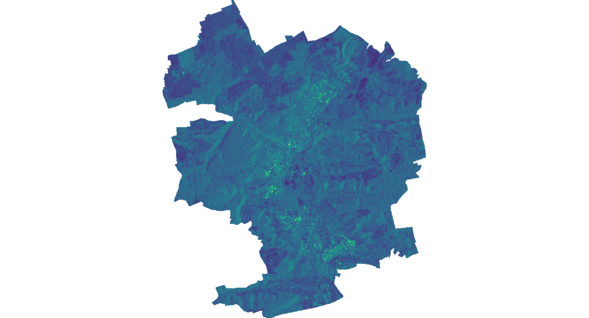
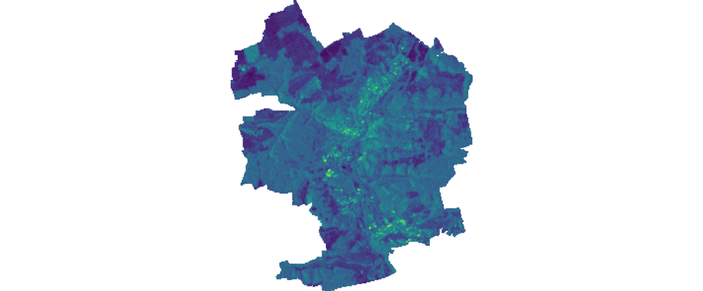

# GRASSINEL
University Project (FSU Jena) by Jonas Ziemer, Marlin M. Mueller and Patrick Fischer

This tool combines [pyroSAR](https://github.com/johntruckenbrodt/pyroSAR) Sentinel-1 preprocessing capabilites with 
[GRASS GIS](grass.osgeo.org) _(Version: 7.9dev)_ functionality for Sentinel satellite imagery. 

It allows for automatic downloading of user-defined Sentinel-1 scenes, pre-processing, subsetting and multitemporal
operations. Data is handled in GRASS internal formats and all available GRASS operations can be applied

#### Functionality Overview:
* Automatic Setup of GRASS environment
* Automatic download of Sentinel-1 data using the GRASS addon i.sentinel.download
* Pre-processing of downloaded Sentinel-1 using pyroSAR functionality ([ESA SNAP](http://step.esa.int/main/download/snap-download/)
 is required for the processing, see [here](https://pyrosar.readthedocs.io/en/latest/?badge=latest))
* Automatic subsetting of satellite data to specified region of interest
* GRASS functionality:
    * Creation of space time raster datasets (STRDS) in GRASS
    * Different multitemporal operations in GRASS
* Future functionality:
    * pyWPS implementation

_Developed in Python 3.6, currently only supported on linux-based OS_

# Installation
In case you have git installed you can install the package as follows:

    pip install git+https://github.com/marlinmm/GRASSINEL.git

# Examples
Example of created timeseries processed using pyroSAR and created using GRASS GIS time series functionality

_Sentinel-1 time series from 2020-06-06 to 2020-07-29 using only relative orbit number 168 in desending direction with
20m resolution with terrain flattening and thermal noise removal active (roughly 5 mins on 14 cores per scene)_

_Sentinel-1 time series from XXX to XXX using all available datasets for the chosen time frame in desending direction 
with 20m resolution without terrain flattening and thermal noise removal (roughly 2 mins on 8 cores per scene)_
